[2021-2022学年第2学期]

# [**实 验 报 告**]

- 课程名称:<u>编程语言原理与编译</u>
- 实验项目:<u>期末大作业</u>
- 专业班级_<u>计算机1904</u>
- 学生学号 <u>31901123 31901125</u>
- 学生姓名 <u>赵佳杰 周禹江</u>
- 实验指导教师: <u>张芸</u>

|  姓名  | 学号     | 班级       | 任务                         | 权重 |
| :----: | -------- | ---------- | ---------------------------- | ---- |
| 赵佳杰 | 31901123 | 计算机1904 | 编译器、修改Java虚拟机、测试 | 0.95 |
| 周禹江 | 31901125 | 计算机1904 | 解释器、测试、文档、代码注释 | 0.95 |

## 成员代码提交日志

1. #### 项目自评等级:(1-5) 请根据自己项目情况填写下表

   （完善程度：个人认为实现的完善程度，个人花费的工作量等
   	难度：实现的困难程度，工作量大小，老师定义的困难程度等）
   
   **注：等级越高，难度越难，完善度越高**

| 解释器                | 完善程度 | 难度 |
| --------------------- | -------- | ---- |
| 各类数组，数组检查    | 4        | 4    |
| bool类型              | 5        | 1    |
| float类型             | 4        | 2    |
| for循环               | 4        | 3    |
| 数据初值定义          | 3        | 4    |
| do-while              | 5        | 3    |
| switch  case  default | 4.5      | 5    |

| 编译器                | 完善程度 | 难度 |
| --------------------- | -------- | ---- |
| 各类数组，数组检查    | 5        | 2    |
| bool类型              | 4        | 1    |
| float类型             | 5        | 2    |
| for循环               | 4        | 4    |
| 数据初值定义          | 3        | 3    |
| do-while              | 5        | 3    |
| switch  case  default | 4        | 1    |
| 修改Java虚拟机        | 3        | 2    |

2. #### 项目说明

   - 整体文件架构

     src文件夹               Java虚拟机

     TestInterp文件夹  解释器测试集

     TestParse文件夹   编译器测试集

     Absyn.fs                 抽象语法

     CLex.fsl          		fslex词法定义

     CPar.fsy             	fsyacc语法定义

     Parse.fs                 语法解析器

     Interp.fs                 解释器

     interpc.fsproj        项目文件

     Contcomp.fs         编译器

     Machine.fs            指令定义

     microcc.fsproj      编译器项目文件

   - 项目运行

     **解释器：**

     dotnet restore interpc.fsproj //可选

     dotnet clean interpc.fsproj  //可选

     dotnet build -v n interpc.fsproj //构建，-v n查看详细生成过程

     ./bin/Debug/net5.0/interpc.exe  测试的文件 参数

     dotnet run -p interpc.fsproj 测试的文件 参数

     dotnet run -p interpc.fsproj -g 测试的文件 参数 //显示token AST 等调试信息  

     **编译器：**

     dotnet restore microcc.fsproj

     dotnet clean microcc.fsproj

     dotnet build microcc.fsproj //构建编译器

     dotnet run -p microcc.fsproj 测试的文件 //执行编译器

     ./bin/Debug/net5.0/microcc.exe 测试的文件 //直接执行

     **Java虚拟机：**

     javac Machine.java

     java Machine 测试的文件（.out)  参数 

     java Machinetrace 测试的文件 参数 //可以查看栈

     

     

     ## 编译器功能展示：

     编译器测试array：

     dotnet run --project microcc.fsproj example_parse/test-array.c 8

     
   
     运行结果：
   
     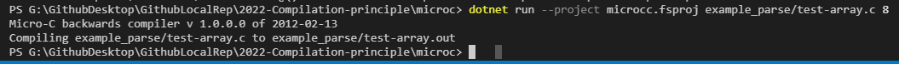
   
     编译器测试bool
   
     dotnet run --project microcc.fsproj example_parse/test-bool.c 8
   
     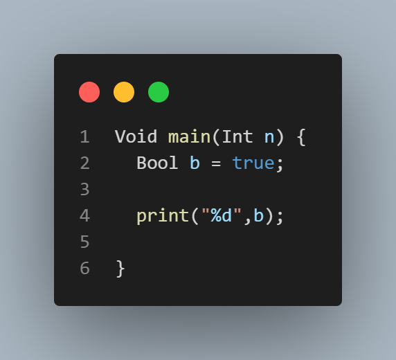
     
     运行结果：
     
     

​			编译器测试float

​			dotnet run --project microcc.fsproj example_parse/test-float.c 8

​    

​			运行结果：

​			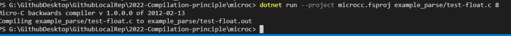

​			编译器测试for循环

​            dotnet run --project microcc.fsproj example_parse/test-for.c 8

​			

​			运行结果：

​			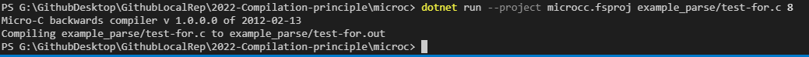

​			编译器测试初值定义

​			dotnet run --project microcc.fsproj example_parse/test-init.c 8

​			

​			运行结果：

​			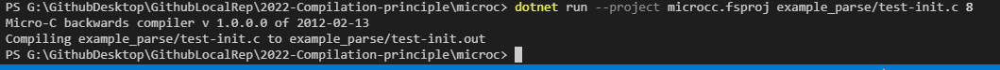

​			编译器测试dowhile

​			dotnet run --project microcc.fsproj example_parse/test-dowhile.c 8

​			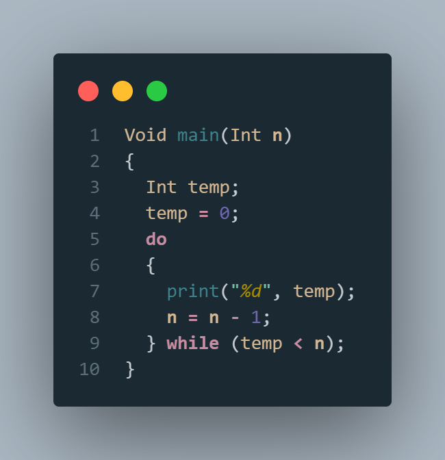

​			运行结果：

​			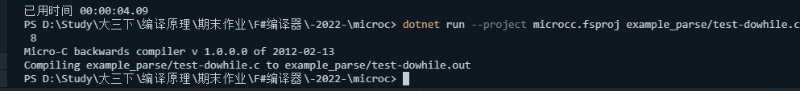

​			编译器测试switch语句

​			dotnet run --project microcc.fsproj example_parse/test-switch.c 8

​			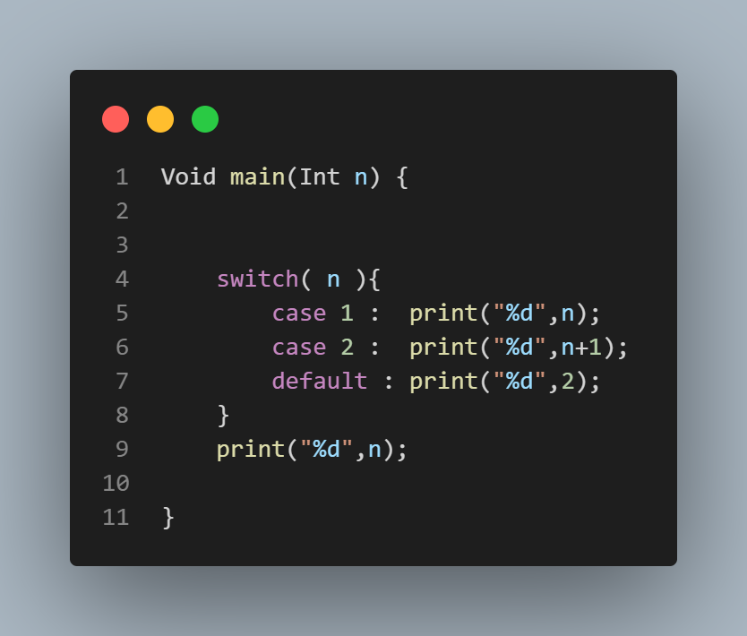

​			运行结果：

​			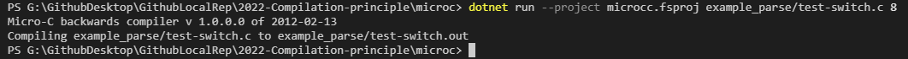

## java虚拟机运行：

javac -Xlint:deprecation Machine.java 

java Machine ../example_parse/test-for.out 8

java Machinetrace ../example_parse/test-for.out 8

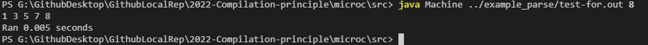

## 解释器功能展示：

1、float类型

代码展示：

运行指令：

**dotnet run -p interpc.fsproj example_inter/test-float.c 1**

运行结果：

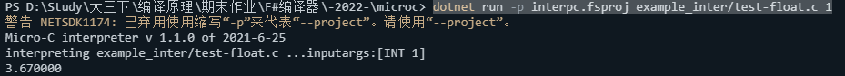

2、bool类型

代码展示：

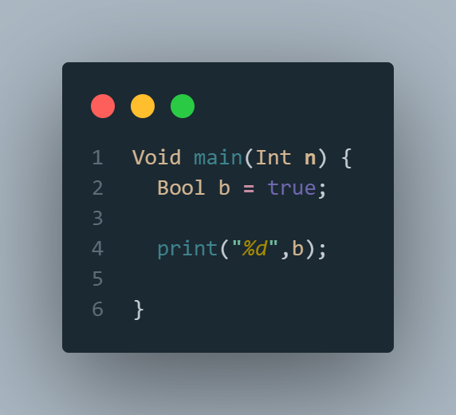

运行指令：

**dotnet run -p interpc.fsproj example_inter/test-bool.c 1**

运行结果：

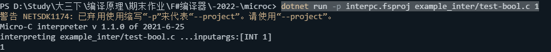

3、各类数组，数组检查

代码展示：

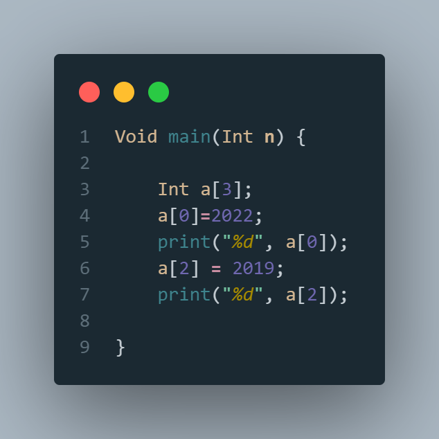

运行指令：

**dotnet run -p interpc.fsproj example_inter/test-array.c 1**

运行结果：

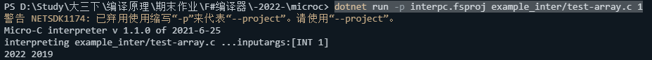

4、for循环

代码展示：

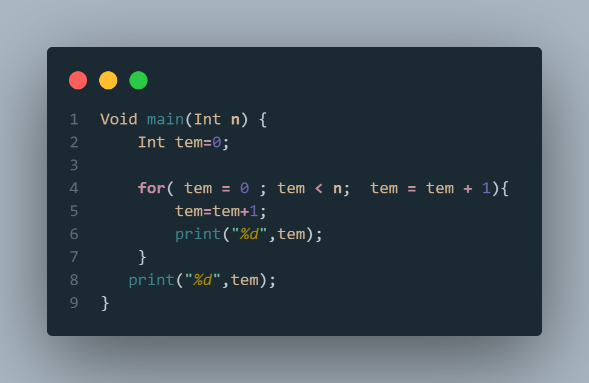

运行指令：

**dotnet run --project interpc.fsproj example_inter/test-for.c 5**

运行结果：

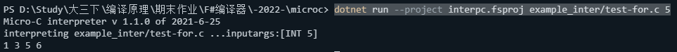

5、数据初值定义

代码展示：

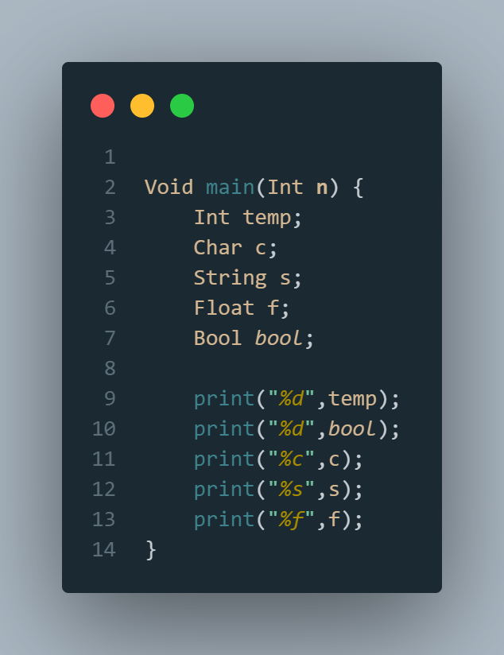

运行指令：

**dotnet run --project interpc.fsproj example_inter/test-init.c 5**

运行结果：

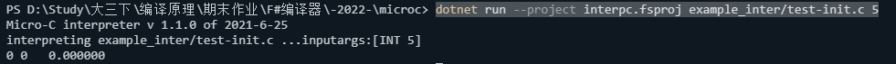

6、do-while

代码展示：

运行指令：

**dotnet run --project interpc.fsproj example_inter/test-dowhile.c 5**

运行结果：

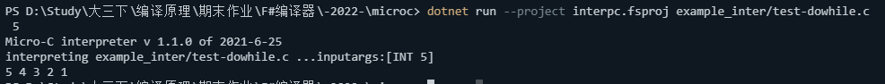

7、switch  case  default

代码展示：

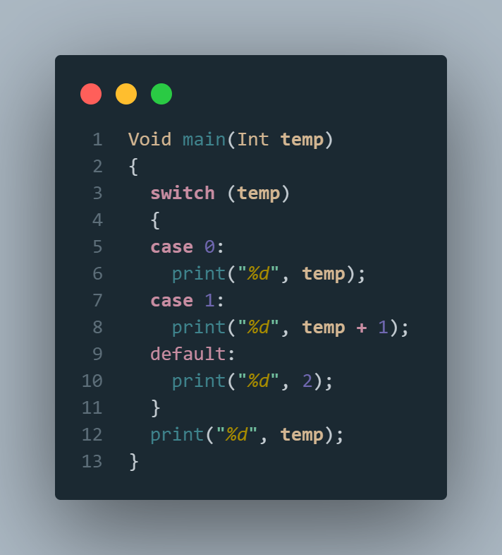

运行指令：

**dotnet run --project interpc.fsproj example_inter/test-switch.c  3**

运行结果：

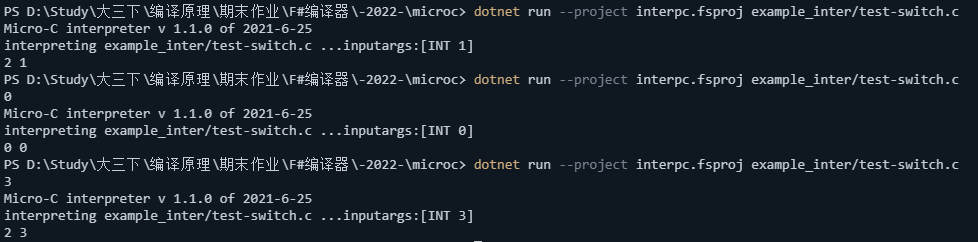

## 心得体会（结合自己情况具体说明）

- 赵佳杰：编译原理的大作业说实话很困难。我们根据现有的代码进行了修改与完善。通过对该课程的学习，了解了什么是编译程序，编译程序工作的基本过程及其各阶段的基本任务，也系统的理解了编译原理程序构造的一般原理和基本实现方法。

- 周禹江：

  ​		

## 本课程建议

- 赵佳杰：

  ​	老师上课教的知识有点抽象，很难很快掌握与理解。

- 周禹江：

  

  